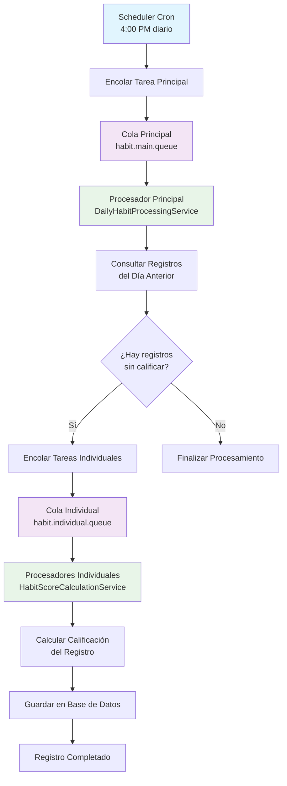
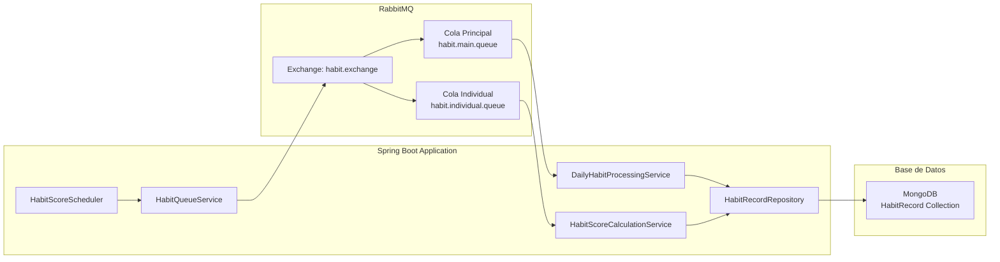
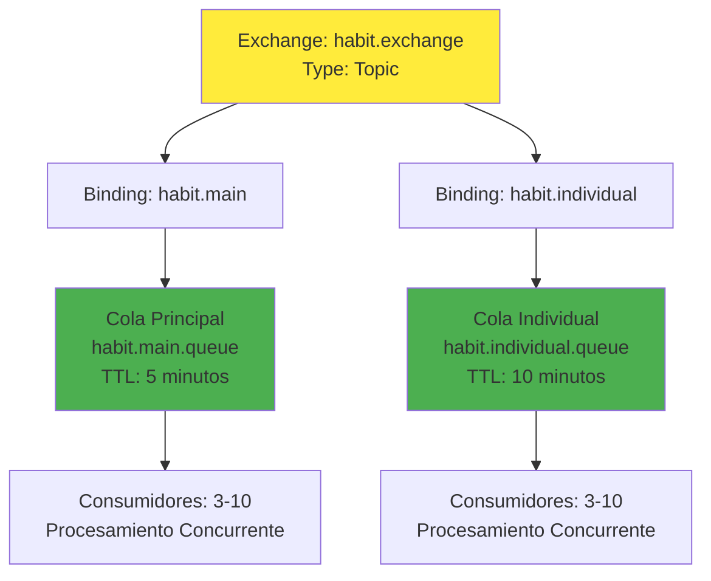
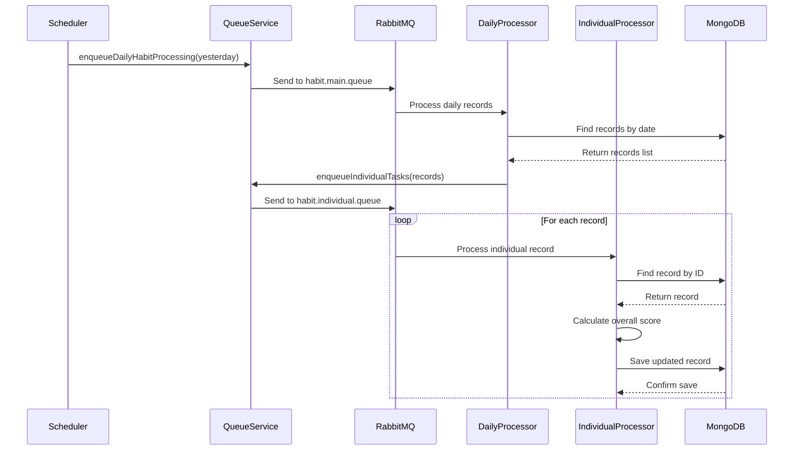

# Diagrama de Arquitectura del Sistema de Colas con RabbitMQ

## Flujo del Sistema de Colas de Tareas

## Componentes del Sistema

## Configuración de Colas

## Flujo de Datos

## Características de Escalabilidad

- **Procesamiento Concurrente**: 3-10 consumidores por cola
- **Colas Durable**: Persistencia de mensajes
- **TTL Configurado**: Evita acumulación de mensajes
- **Retry Logic**: Hasta 3 intentos por tarea
- **Dead Letter Queue**: Para mensajes fallidos (implementación futura)

## Ventajas de RabbitMQ

### ✅ **Para Desarrollo Local:**
- **Fácil Instalación**: Un comando con Homebrew
- **Configuración Simple**: Configuración mínima requerida
- **Interfaz Web**: Monitoreo visual en localhost:15672
- **Open Source**: Gratuito y flexible
- **Control Total**: Configuración completa del sistema

### ✅ **Escalabilidad:**
- **Procesamiento Concurrente**: Múltiples consumidores
- **Colas Durable**: Persistencia de mensajes
- **Clúster**: Alta disponibilidad
- **Load Balancing**: Distribución de carga

### ✅ **Monitoreo:**
- **Interfaz Web**: Dashboard completo
- **Métricas**: Estadísticas en tiempo real
- **Logs**: Logging detallado
- **Alertas**: Configuración de alertas

## Comparación con Cloud Tasks

| Característica | RabbitMQ | Cloud Tasks |
|----------------|----------|-------------|
| **Costo** | Gratuito | Pago por uso |
| **Mantenimiento** | Manual | Automático |
| **Escalabilidad** | Manual | Automática |
| **Monitoreo** | Básico | Avanzado |
| **Vendor Lock-in** | No | Sí |
| **Desarrollo Local** | Fácil | Complejo |
| **Producción** | Requiere configuración | Plug & Play |

## Próximos Pasos

1. **Instalar RabbitMQ**: `brew install rabbitmq`
2. **Iniciar RabbitMQ**: `brew services start rabbitmq`
3. **Ejecutar la aplicación**: `mvn spring-boot:run`
4. **Monitorear colas**: http://localhost:15672
5. **Verificar logs**: Revisar logs de la aplicación